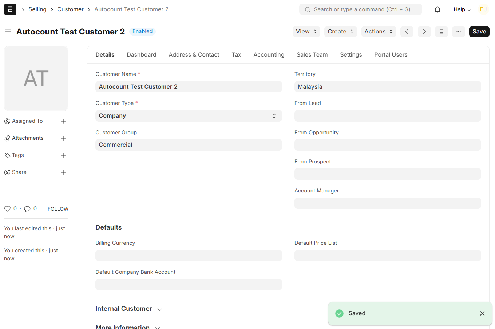
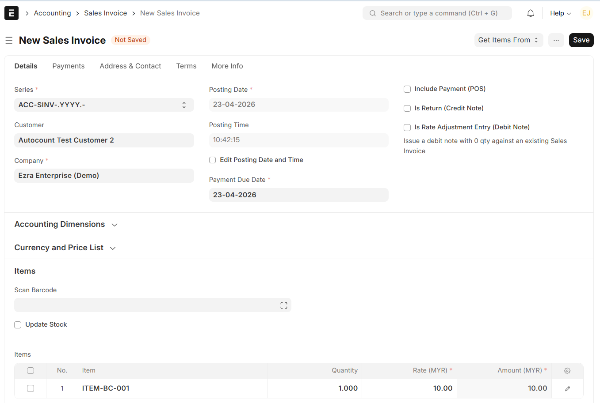
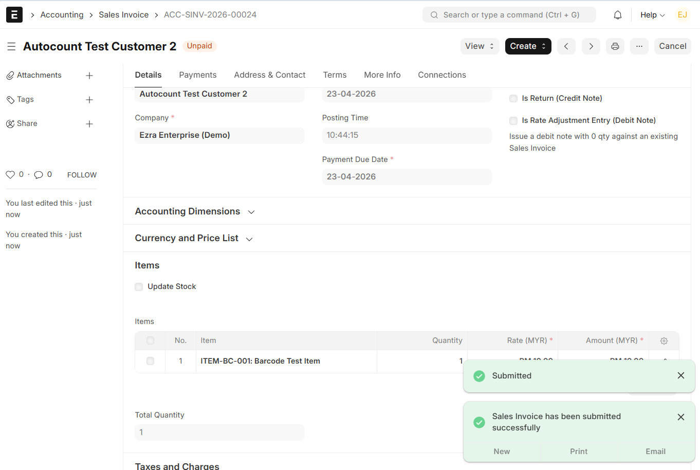

# Autocount Integration with ERPNext v15

## Overview

Autocount is an external accounting system. This integration demonstrates how ERPNext handles accounting data such as customer records and sales invoices, which can later be synchronized with Autocount.

---

## 1. Create Customer

A new customer was created in ERPNext for testing the accounting workflow.

---

## 2. Create Sales Invoice (Before Submit)

A Sales Invoice was created for the customer before submission.

---

## 3. Submit Sales Invoice

The Sales Invoice was successfully submitted.

---

## Workflow Summary

1. Created Customer in ERPNext  
2. Generated Sales Invoice  
3. Submitted invoice successfully  
4. Data ready for integration with Autocount  

---

## Result

- Customer created successfully  
- Sales Invoice generated and submitted  
- ERPNext accounting workflow validated  

---

## Conclusion

ERPNext successfully supports the accounting workflow required for integration with external systems like Autocount. This demonstrates readiness for further system integration and automation.