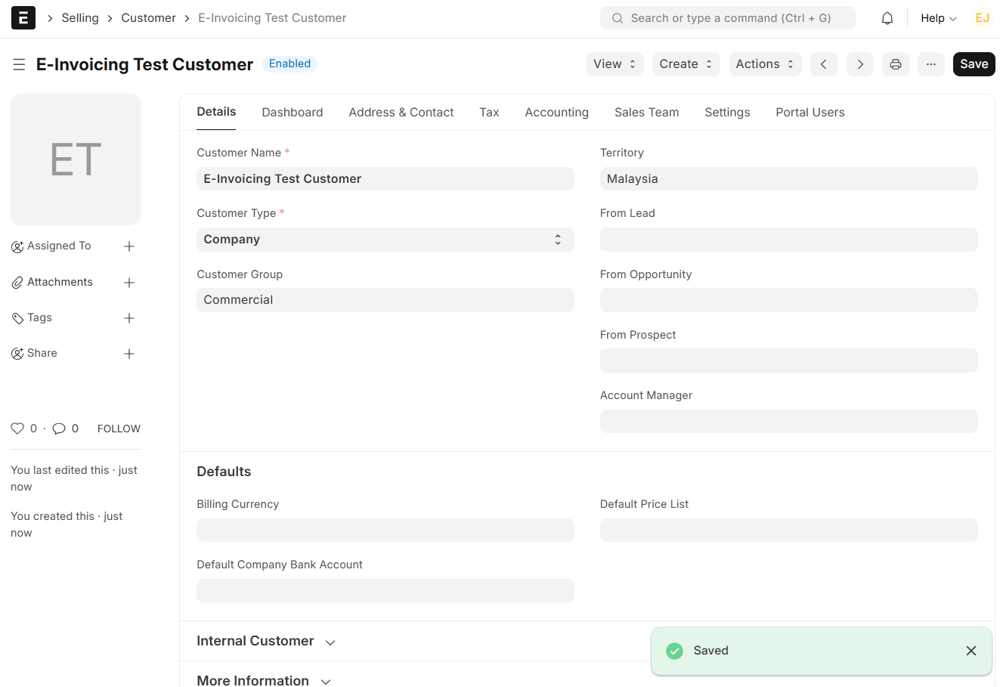
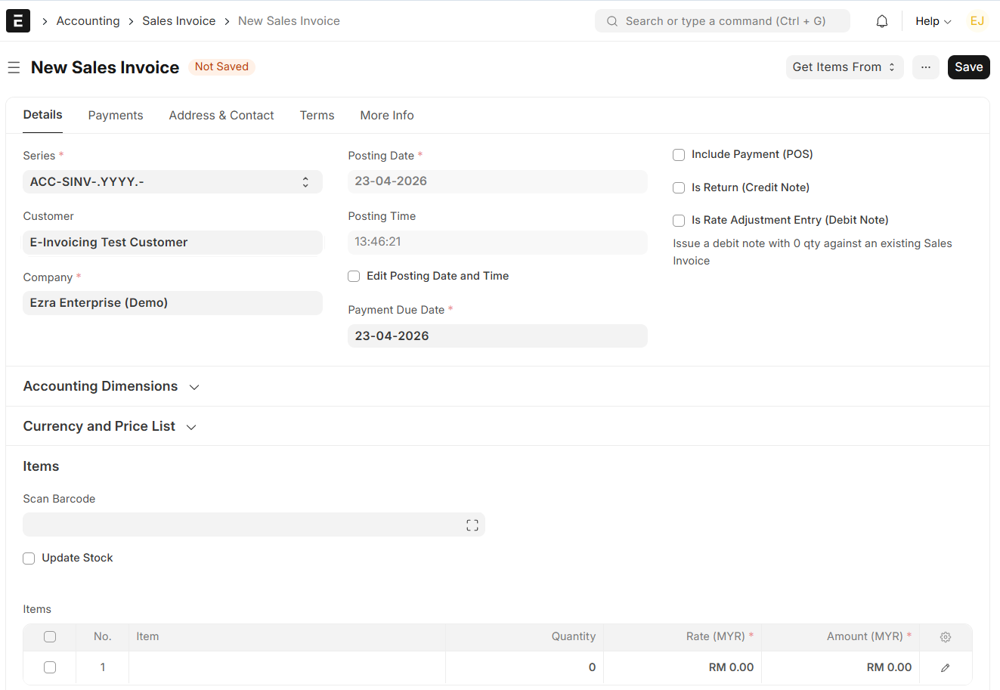
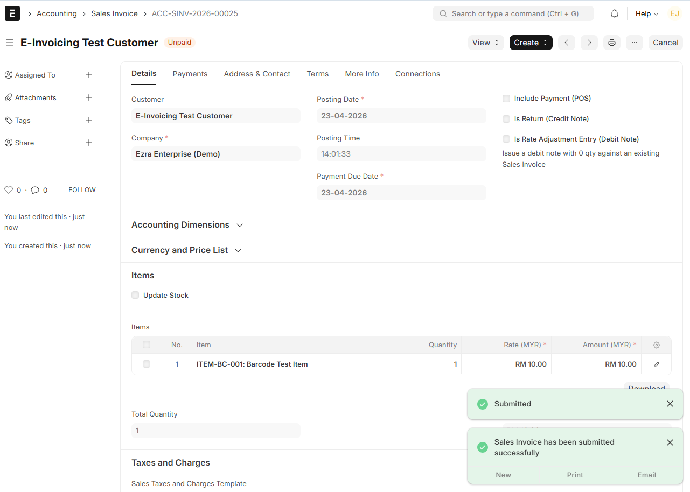

# E-Invoicing Integration with ERPNext v15

## Overview

E-Invoicing is a digital invoicing process that allows businesses to generate, validate, and submit invoices electronically to external systems such as LHDN MyInvois.

---

## Workflow

1. Create Customer in ERPNext
2. Create Sales Invoice
3. Submit Sales Invoice
4. Data ready for integration with external e-invoicing system

---

## Step 1: Customer Creation

A new customer was created in ERPNext for e-invoicing simulation.

---

## Step 2: Sales Invoice (Before Submit)

Sales Invoice was created with item and pricing details before submission.

---

## Step 3: Sales Invoice (After Submit)

Sales Invoice was successfully submitted, representing finalized transaction data.

---

## Result

ERPNext successfully processes invoice data which can be extended for integration with external e-invoicing systems.

---

## Conclusion

The e-invoicing workflow has been successfully simulated in ERPNext v15. The system is ready to be integrated with external platforms such as LHDN MyInvois API.